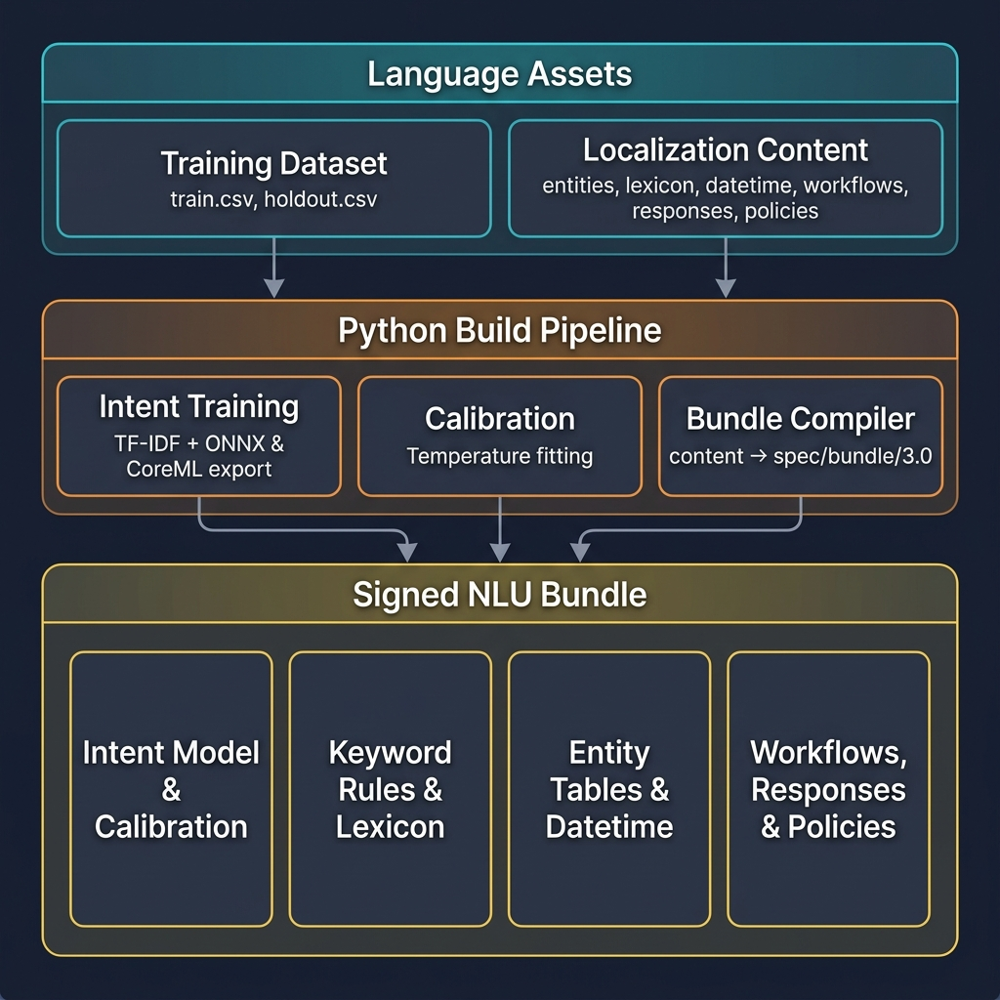

# Python Build Pipeline & NLU Pack Output

Here is the diagram focusing exclusively on the Python Build Pipeline, its components, and the self-contained `.nlu` language pack it produces (reflecting both ONNX & CoreML export):

## Python Pipeline Components

The Python pipeline is purely a build-time system. Its only job is to ingest raw language assets and produce the `.nlu` language pack. It consists of three main stages:

### 1. Intent Training
- **What it does:** Reads the `train.csv` dataset for a specific language. It cleans the data, runs cross-validation, and trains the TF-IDF + Logistic Regression classification pipeline.
- **Output:** It exports the trained model weights into deployment-ready formats: **ONNX** (for Android) and **CoreML** (for iOS). It also outputs the exact intent labels used (`labels.json`).

### 2. Calibration
- **What it does:** Runs out-of-fold predictions to calculate the exact Temperature (`T`) for the newly trained model weights. When the ONNX or CoreML model runs on mobile, it outputs raw, unscaled numbers called "logits". The mobile NLU engine needs this `T` value to perform the mathematical scaling (`softmax(logits / T)`) that turns those raw logits into reliable 0-to-1 confidence scores.
- **Why it matters:** The mobile NLU engine relies entirely on these scaled confidence scores to make dialogue decisions. For instance, if a user's utterance scores below the `0.70` threshold, the engine will reject it and fallback to GenAI. If it scores `0.76` (between `0.70` and `0.80`), the engine pauses and triggers a confirmation prompt ("Are you sure?"). A wrong or missing `T` would make the mobile app dangerously overconfident (misfiring actions) or frustratingly underconfident (constantly asking for confirmation).
- **Output:** A `calibration.json` file (bundled right next to `model.onnx`) containing the exact temperature and confidence floor for that specific model.

### 3. Bundle Compiler
- **What it does:** Validates and transforms the raw YAML/JSON content files (intents, entities, workflows, responses, and lexicons) into the highly optimized, spec-compliant format (`spec/bundle/3.0`) required by the mobile runtimes.
- **Output:** It packages the compiled content, the exported models, and the calibration data into a single, versioned, cryptographic-signed `.nlu` file. This pack is the self-contained "brain" that the mobile platforms download and run.

---

## Continuous Integration & Delivery (CI/CD) Workflow

The process of delivering a new language to mobile apps is fully automated and **requires zero code changes** on iOS or Android. It is entirely driven by data and GitHub Actions. 

Here is the professional end-to-end flow of what happens in the background when a new language is added:

### Step 1: Asset Integration (The PR)
1. An engineer or localization team opens a Pull Request to the `main` branch adding the language data.
2. This PR contains **no Python code**. It only includes:
   - A training dataset: `datasets/{lang}/train.csv`
   - Evaluation holdouts: `datasets/{lang}/holdout_honest.csv`
   - Translated content: `content/localization/*.{lang}.json` (lexicons, entities, responses)

### Step 2: Automated Pipeline Trigger
1. When the Pull Request is merged into the `main` branch, the CI/CD pipeline (e.g., GitHub Actions) automatically detects the presence of the new `datasets/{lang}/train.csv` file.
2. The pipeline dynamically spawns an isolated build job specifically for that language.

### Step 3: Model Training & Calibration
1. **Train:** The pipeline executes `python -m nlu_training.train --lang {lang}`. This trains the TF-IDF and Logistic Regression models and exports the weights to CoreML and ONNX formats.
2. **Calibrate:** The pipeline executes `python -m nlu_training.fit_calibration --lang {lang}` to mathematically tune the confidence temperature (`T`) based on out-of-fold predictions.

### Step 4: Quality & Safety Gates (Validation)
Before anything is packaged, the pipeline runs strict evaluation gates using `evaluate.py`:
1. **Accuracy Floor:** The model is tested against the `holdout_honest.csv` (data it has never seen). If the accuracy falls below the required threshold (e.g., `0.80`), the pipeline fails immediately. 
2. **Safety Budget:** The pipeline ensures that confident "wrong actions" (where the model confidently misclassifies an intent into a dangerous device command) do not exceed the medical-safety budget.

### Step 5: Compilation & Signing
1. Once the quality gates pass, the pipeline runs the **Bundle Compiler**.
2. It aggressively minifies the JSON/YAML content, strips comments, and validates every workflow reference against the official schema.
3. The compiler packages the CoreML/ONNX models, the `calibration.json`, and the optimized content into a single file: `pack-{lang}-vX.Y.Z.nlu`.
4. Finally, the pipeline digitally signs the bundle using a secure Ed25519 private key (injected via CI secrets). This ensures the mobile device can verify the bundle hasn't been tampered with.

### Step 6: Distribution (CDN & Mobile Apps)
1. The signed `.nlu` pack is uploaded to the release artifact repository (e.g., AWS S3, Cloudflare, or GitHub Releases).
2. iOS and Android applications periodically poll the CDN endpoint for updates. When they detect the new language pack, they download it in the background.
3. Using the universal `BundleManager`, the mobile app verifies the cryptographic signature, atomic-swaps the new language pack into the active slot, and the app instantly understands the new language—all without a single App Store or Google Play update.
