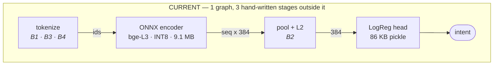
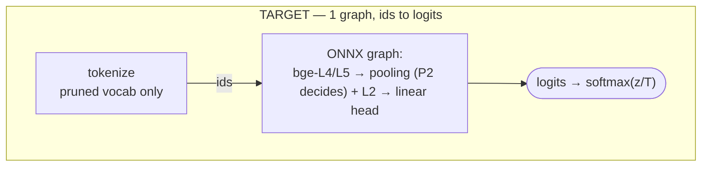
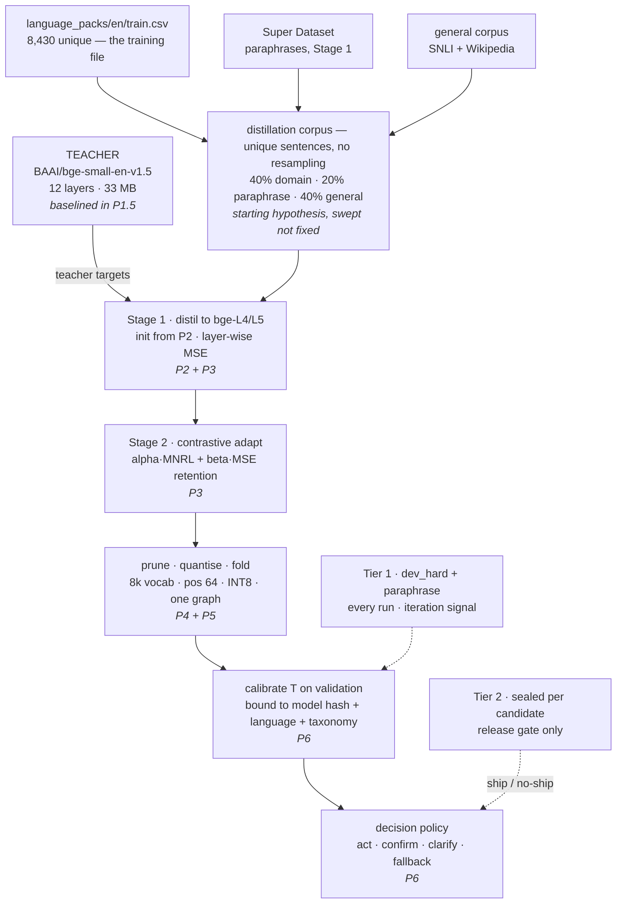

# Semantic Compression Plan — one teacher, one student, smallest safe model

> **Governing principle.** We are not optimising for the smallest model. We are optimising for the **smallest model that preserves the semantic generalisation and behavioural safety the product requires.** 12 MB is a budget, not the objective.

> **Discipline rule.** This document distinguishes five things that are easy to conflate, and every claim below is labelled as one of them: **artifact reproducibility** ≠ **model quality**; **model quality** ≠ **product safety**; **hypothesis** ≠ **measurement**; **minimum meaningful effect** ≠ **expected improvement**; **current evidence** ≠ **future prediction**.

> **Status:** review complete. Ready for execution. Nothing in this document has been applied to the repository.
> **Date:** 2026-08-22 (rev. 5 — final)
> **Branch measured:** `feature/Akash/semantic_with_new_csv-DataGeneration-Automation` @ `f927b17`
> **Companion documents:** `nlu_super_dataset_architecture.md` (data), `distillation_plan_review.md` (Stage 1 review), `../Review-F5/EXECUTION_STATUS.md` (blocker B8), `spec/bundle/3.0/` (artifact schemas)

Every number below was measured against the artifacts in this repository on 2026-08-22, on staged copies in an isolated sandbox. No repository file was modified. Where an earlier claim did not survive measurement it is retracted rather than quietly dropped. Reproduction instructions are in §14.

**Revision history**
- **Rev 1** — initial plan.
- **Rev 2** — single-lineage commitment; training-set provenance finding; calibrated confidence statement.
- **Rev 3** — frozen teacher baseline (P1.5), Pareto reframing, artifact-contract CI, Tier-2 report card, clarification success metrics, consolidated release gate, governing principle.
- **Rev 4** — hypothesis/measurement separation: P0 reframed as a reproducibility gate; retention floor deferred until the teacher is measured; predicted improvement magnitudes replaced with pre-registered minimum meaningful effects; Tier-2 sealing clarified as per-candidate.
- **Rev 5.3** — P1 pre-flight. Three findings from re-measuring the instruments against the files as they stand today: **B9 is larger than recorded** (the manifest is stale on *both* files it pins, not one — the holdout's labels were rewritten by `af4a88b` at an unchanged row count); **the 44% near-duplicate figure had no committed script** and re-measures at 657/1,470 rather than 647; and **`holdout_honest.csv` is derived from `train.csv`** by `scripts/ci/build_honest_holdout.py` and is frozen by design (§4). P1 gains a `dev_hard` freeze policy and a near-duplicate CI guard, which turn the Super Dataset landing from a rebuild into a filter. No phase added, no gate moved.
- **Rev 5.2** — **B13** added to the register: the out-of-directory benchmark script bypasses the label-compatibility boundary, which is why one row reads 0.00%. Verified pre-existing — `label_compat.py` and the migration map are byte-identical on `feature/removeing_confirmation_code_APIVersion`, and `scripts/evaluate_models.py` does not exist on that branch at all. No phase, gate or number changed.
- **Rev 5.1** — P0 executed. Gate fingerprint corrected from 0.862 to **0.8578** and the two instruments named (the earlier figure came from a re-fitted head, not the shipped one). B10, B11 and B12 added to the register, all found during implementation.
- **Rev 5 (final)** — **training file settled by owner decision** (§2), which unblocks P0/P1. **Statistical power analysis added** (§10): the Rev-4 minimum meaningful effects were set below the noise floor of the planned instruments, so they are re-set to what the instruments can actually resolve, and decisions move to a paired test. **Two numerical corrections** (§2, §3), listed in §14. No phases added, no experiments added, no change to the P0–P8 sequence or to the teacher/student, evaluation, artifact, graph or safety architecture.

---

## Contents

| § | |
|---|---|
| 0 | Correction — the bge-small head was trained correctly |
| 1 | One teacher, one student — and what is still open |
| 2 | The training file, and what remains to confirm |
| 3 | Measured baseline |
| 4 | Both evaluation instruments are unreliable |
| 5 | Defect register |
| 6 | Which transformer layers to keep — measured |
| 7 | Size budget and the Pareto objective |
| 8 | Target architecture |
| 9 | The plan — P0 … P8 |
| 10 | Experiment register, and what our instruments can resolve |
| 11 | How much confidence this plan deserves |
| 12 | Release gate |
| 13 | Deferred review items |
| 14 | Risks, decisions, corrections, reproduction |

---

## 0. Correction — the bge-small head was trained correctly

An earlier session claimed `output_models/classifier_head.pkl` had been fitted on corrupted embeddings, because `train_experimental_head.py` resolves the tokenizer to a path that does not exist. **That claim was wrong and is retracted.**

A classifier head is both *more accurate* and *more confident* on the distribution it was fitted on. Scoring the shipped head through every candidate pipeline:

| Pipeline the shipped head is scored through | Holdout acc | Mean top-1 confidence |
|---|---:|---:|
| **bge-L3 · CLS pooling · pruned 10k tokenizer** | **0.8442** | **0.7036** |
| bge-L3 · CLS pooling · full 30.5k tokenizer + clamp | 0.7857 | 0.6345 |
| bge-L3 · mean pooling · pruned tokenizer | 0.8088 | — |

The head peaks on the correct pruned tokenizer with CLS pooling, on both measures. **The shipped bge-small artifact is clean.**

### What remains true

```python
# train_experimental_head.py
tokenizer_path = path.parent.parent / "pytorch"
if not tokenizer_path.exists():
    tokenizer_path = "sentence-transformers/all-MiniLM-L6-v2"   # full 30,522 vocab
```

Correct for the `track1_pruned_l3` / `track3_svd_l6` layouts, where the model sits one level deeper inside `onnx_quantized/`. The bge export places the model directly in its own directory, so `parent.parent` overshoots onto `output_models/pytorch` — **verified absent**.

Measured cost if it fires, on train + holdout text: **7.17%** of token occurrences corrupted, touching **46.6%** of utterances, holdout accuracy **0.860 → 0.761** in a single controlled comparison. The corruption concentrates on intent-bearing words, including `reminder`, `app`, `remind`, `adjust`, `alert`, `pairing`, `settings`, `streaming`, `translate`, `mute`, `locate` and `decrease`.

*(That comparison used one measurement run throughout, so the 0.860 and 0.761 are directly comparable to each other. The baseline table in §3 cites 0.862 from a separate run — see the run-variation note there.)*

**Latent defect, not a historical one.** P0 item 3.

---

## 1. One teacher, one student

| Role | Model | Status |
|---|---|---|
| **Teacher** | `BAAI/bge-small-en-v1.5` — 12 layers, 384 hidden, 30,522 vocab | **the only teacher.** Representation: CLS is the teacher's **native** pooling and the **current measured pipeline** — see below |
| **Student** | bge-small-L*n* — 384 hidden / 1536 FFN, pruned vocab, INT8. *n* grows 3 → 4 → 5 as the Pareto search allows | **the only student** |
| Reference | `all-MiniLM-L6-v2` (22.9 MB, generic) | **not a candidate.** Interim benchmark (0.804 paraphrase) until P1.5 replaces it with the real teacher. Also the untrained control in leakage tests |
| Suspended | MiniLM-L3 lineage — `distilled_minilm_l3`, `stage2_contrastive_minilm_l3`, `stage2_contrastive_onnx`, `final_distilled_onnx` | **frozen, not extended.** Formal retirement decided in P1 — see below |

### Representation: what is settled and what is not

CLS pooling is not an arbitrary choice — BAAI trained bge-small with CLS, the repository's `1_Pooling/config.json` reflects that, and every measurement in this document used it. **That much is settled.**

What is **not** settled: whether CLS remains optimal for a **3–5 layer distilled student on this task**. A shallow student's `[CLS]` token has passed through a fraction of the teacher's attention stack, and masked-mean pooling sometimes recovers more in that regime. **P2 tests CLS versus masked-mean on the real bge-small L12 teacher and on the distilled students, before the representation is committed.** Until then this document writes CLS as *current*, not as *proven*.

### Why bge-small, and why retirement waits

| | bge-L3 | MiniLM-L3 | Decides |
|---|---:|---:|---|
| `holdout_honest` (44% near-duplicate) | 0.862 | **0.870** | the contaminated instrument |
| zero-shot paraphrases (46 rows) | **0.717** | 0.652 | the instrument that predicts field behaviour |

bge wins by 6.5 points on the instrument that matters and loses 0.8 on the one we know is bent. It also carries native CLS pooling plus a `2_Normalize` module, which suits the target single-graph export.

> **Honest weakness in this decision.** The zero-shot set is 46 rows. 0.717 vs 0.652 is **33 correct versus 30 — a difference of three phrases**, far below what a 46-row set can resolve (§10). That is thin evidence on which to retire an entire lineage. bge remains the working lineage for all planning purposes, but **formal retirement of the MiniLM branch is a P1 gate**, decided against the expanded set. Do not delete the MiniLM artifacts before then.

One consequence for §6: the layer probe in this document ran on MiniLM-L6, because HuggingFace was unreachable from the measurement sandbox. **That was a proxy instrument, not a candidate model.** P2 re-runs the identical probe on bge-small L12.

---

## 2. The training file, and what remains to confirm

### Owner decision — settled

> **`language_packs/en/train.csv` is the training file for this project.** That file and that folder are what all training uses. `new_semantic/data/en/train.csv` and `complete_csv.csv` are **not** training inputs for this lineage and must not be uploaded to a training run.

This closes the forward-looking half of the question. `TRAIN_CSV_PATH` in `colab_stage2_contrastive.py` changes from a bare `"train.csv"` to that explicit repo-relative path, and the script prints the file's sha256 and row count at startup so the decision is enforced by the code rather than by memory.

### Why it was ever in doubt

`colab_stage2_contrastive.py` reads a bare filename in the Colab working directory, and the repository contains three files that could have been uploaded under that name:

| Candidate | Rows | Holdout rows present **verbatim** | Status |
|---|---:|---:|---|
| **`language_packs/en/train.csv`** | 8,430 | **0** (0.0%) | **the training file** |
| `new_semantic/data/en/train.csv` | 23,989 | 585 (39.8%) | not a training input |
| `complete_csv.csv` | 31,699 | 1,461 (99.4%) | not a training input |

### SC-0 — what is left, and what it now blocks

The owner decision settles which file is used **going forward**. It does not by itself produce a record of which file the **historical** Stage-2 run consumed, and that run produced the §3 baseline. Three pieces of evidence, all pointing the same way:

1. **Owner statement** — `language_packs/en/train.csv` is the project's training file.
2. **Timeline.** The bge Stage-2 run finished 2026-08-10 07:50. `new_semantic/data/en/train.csv` was first committed 2026-08-11 (`0b8dafa`); `complete_csv.csv` on 2026-08-12 (`49c03c8`). Both post-date the run.
3. **Differential leakage test** — a weak residual signal that does not reach significance. If the student had trained on `new_semantic/train.csv`, it should score much better on the 585 holdout rows in that file than on the 885 absent ones, while an untrained control shows no such gap:

| Encoder | present (585) | absent (885) | gap |
|---|---:|---:|---:|
| bge-L3 stage2 | 0.9162 | 0.8260 | +0.090 |
| Stage-1 only | 0.8735 | 0.7243 | +0.149 |
| MiniLM-L6 generic *(control)* | 0.8068 | 0.7932 | +0.014 |

Most of that raw gap is the near-duplicate contamination documented as B7: 57.8% of "present" rows are near-duplicates of the training set, versus 34.9% of "absent" rows. Isolating the **247 rows that are in `new_semantic` but *not* near-duplicates of the training set**:

| Encoder | decisive 247 | clean-and-absent (~576) | gap |
|---|---:|---:|---:|
| bge-L3 stage2 | 0.8583 | 0.8281 | +0.030 |
| MiniLM-L6 generic *(control)* | 0.7692 | 0.7934 | −0.024 |

**The standard error on each of those gaps is ≈0.027 at these subset sizes, so the bge gap of +0.030 is 1.1 SE — not distinguishable from zero.** A plausible non-leakage explanation also fits: the 585 rows are canonical, template-shaped utterances that recur across corpora, and a domain-distilled model benefits from familiar sentence shapes without ever having seen those exact strings — which is why the generic control, having no domain training at all, shows no gap either way.

> **Correction to earlier revisions.** Rev 2–4 quoted this interval as "±0.045". That figure was wrong. The correct standard error is ≈0.027 (95% CI ≈ ±0.053). The corrected number makes the residual signal *weaker*, not stronger.

**SC-0 is therefore downgraded from "blocks everything" to "confirm before P2."**

P0 fixes defects and P1 builds instruments; neither depends on §3's baseline being clean. The first work that *does* depend on it is P2, which compares new students against that baseline. So: **P0 and P1 start now.** Before P2 spends GPU time, open the historical Colab and read the line it prints before training —

```
Total Utterances Used: N / N
```

— and record it. **N ≈ 8,430** confirms `language_packs/en/train.csv` and §3 stands. **N ≈ 23,989 or ≈ 31,699** means the baseline is contaminated and Stage 2 re-runs before P2 proceeds. If the notebook is no longer available, record that fact instead, and treat §3 as an unverified reference rather than a baseline.

### Provenance record — commit this, every run

```json
{
  "stage": "stage2_contrastive",
  "training_file": "language_packs/en/train.csv",
  "rows": 8430,
  "intents": 57,
  "sha256": "…",
  "trained_at": "2026-08-10T07:50:00Z",
  "git_commit": "…",
  "runtime": "colab T4 / <notebook id>",
  "teacher": "BAAI/bge-small-en-v1.5",
  "student_init_layers": [0, 5, 11],
  "pooling": "cls"
}
```

**This class of ambiguity must not recur.**

### A second integrity problem found while checking

`language_packs/en/extras/holdout_honest.manifest.json` freezes the split and warns that changing either file invalidates every number.

| | Manifest | Actual today |
|---|---|---|
| `train.csv` sha256 | `eed41449…` | `803a97d5…` |
| `holdout_honest.csv` sha256 | `c1e3ee70…` | `a6940376…` |
| `train.csv` rows | 8,353 | **8,430** |
| `holdout_honest.csv` rows | 1,470 | 1,470 ✓ |

The one recorded amendment relabelled five rows; relabelling does not change counts. **`train.csv` has gained 77 rows since the freeze and the manifest was never updated.** Exact disjointness still holds (0 overlap measured), so no damage — but the guard built to make drift visible has been silently drifting. Re-freeze in P1 (B9).

> The repository has more evaluation instruments than earlier revisions credited — `holdout_leakage_guard.csv` (331 rows, difficulty-labelled), `holdout_paraphrase.csv` (100 rows), `datasets/semantic_holdout_2.csv`. P1 inventories them rather than building new ones from scratch.

---

## 3. Measured baseline

Head re-fitted identically for every row using the repository's own strategy — `language_packs/en/train.csv` capped at 250/intent plus `oos_2.csv` as Fallback, `LogisticRegression(C=3.0, class_weight="balanced")`.

| Encoder | Size | Pooling | `holdout_honest` (1,470) | zero-shot (46) |
|---|---:|---|---:|---:|
| TF-IDF + LogReg *(shipping)* | 1.8 MB | — | **0.918** | 0.543 |
| **bge-L3 Stage 2 — the student** | 9.1 MB | cls | 0.862 | 0.717 |
| bge-L3 Stage 1 only | 9.1 MB | cls | *not built* | *not built* |
| **bge-small L12 — the teacher** | 33 MB | cls | *not measured* | *not measured* |
| MiniLM-L3 Stage 2 *(suspended branch)* | 9.1 MB | mean | 0.870 | 0.652 |
| MiniLM-L3 Stage 1 *(suspended)* | 9.1 MB | mean | 0.784 | 0.587 |
| MiniLM-L6-v2 *(interim reference)* | 22.9 MB | mean | 0.799 | **0.804** |
| Semantic Student *(from scratch, abandoned)* | 1.2 MB | — | — | 0.457 |

Zero-shot for rows 1 and 8 come from `unseen_predictions.md`; every other cell was measured this session.

> **Run-to-run variation.** The same encoder measured under two different batching/padding schemes on the INT8 graph differed by **up to 0.006** (bge-L3 0.8599 / 0.8619; MiniLM-L3 0.8687 / 0.8701; Stage-1 0.7782 / 0.7837). Earlier revisions quoted "±0.002", which understated it. **Treat any difference below 0.006 between two runs of the same artifact as noise, not signal** — this is also why P5 tests padding invariance explicitly.

> **Read these as artifact measurements, not quality claims.** `holdout_honest` is 44% near-duplicate (§4) and the zero-shot set is 46 rows. The column that decides anything does not exist yet; P1 builds it.

> **Two holes in the evidence, both scheduled.**
> **(a)** There is no bge **Stage-1-only** artifact, so the +8.6-point Stage-2 gain measured on MiniLM (0.784 → 0.870) has never been reproduced on the shipping lineage. → **P2**.
> **(b)** The **teacher itself has never been measured** through this contract. The 0.804 target is borrowed from a model we are not using. → **P1.5**.

### What the table says

1. **Stage 2 contrastive adaptation works** — demonstrated on MiniLM, assumed on bge.
2. **The student beats a 2.5× larger generic encoder in-distribution** (0.862 vs 0.799).
3. **The student loses to it on paraphrases** (0.717 vs 0.804, a gap of 8.7 points) — the failure mode `distillation_plan_review.md` predicted under *"the encoder becomes task-specific rather than general-purpose."* **Closing this gap is the purpose of this plan.**
4. TF-IDF's 0.918 is an artefact of the contaminated holdout, not evidence that lexical matching wins. It scores 0.543 on paraphrases.

---

## 4. Both evaluation instruments are unreliable

### `holdout_honest.csv` is 44% paraphrase

| Overlap with `language_packs/en/train.csv` | Rows | Share |
|---|---:|---:|
| Exact text match | 0 / 1,470 | 0.0% |
| Near-duplicate (token Jaccard ≥ 0.8) | 657 / 1,470 | **44.7%** |

> Re-measured 2026-08-22 against the current files using the repository's own
> `nlu_training.leakage.normalize_text`. Rev 2–4 recorded 647 / 44.0%; that
> figure came from an ad-hoc measurement with **no committed script**, so the
> 10-row difference cannot be attributed to `train.csv`'s +77-row drift rather
> than to a difference in tokenisation — the earlier method is unrecoverable.
> This is itself the finding: a number that steers the plan had no reproducible
> source. P1 replaces both figures with whatever the committed split script
> emits, and that becomes the number of record.

Near-duplicate means shared words, and shared words is what TF-IDF *is*. The instrument rewards memorisation and penalises the generalisation the megabytes are being spent on.

### The honest holdout is derived from `train.csv`, and frozen on purpose

`holdout_honest.csv` is not an independently authored set. It is a 15%
stratified partition of `train.csv`, produced by `scripts/ci/build_honest_holdout.py`,
grouped by normalised text so that repeated sentences cannot straddle the split.
That script refuses to run a second time:

> `FAIL: holdout_honest.csv already exists. The holdout is FROZEN once built —`
> `re-splitting silently changes every number measured against it.`

Two consequences the plan did not previously state:

1. **The instrument moves when the training data moves.** Near-duplication is a
   relation between holdout and train, not a property of a row. Adding rows to
   `train.csv` can turn a `dev_hard` row into a near-duplicate without touching
   `dev_hard` — it stops being hard while still looking unchanged.
2. **The repository has already decided not to rebuild it**, and that decision is
   correct. A rebuilt ruler makes P2's numbers incomparable with P3's, which
   forfeits the entire point of running the phases in sequence.

So the Super Dataset must enter **training only**. The instrument that judges it
on fresh ground is the sealed Tier-2 holdout (P1), built outside the generator's
prompt lineage — not a re-split of this file.

### The taxonomy itself is mixed, and that is not a defect to fix here

`train.csv`'s 57 labels are legacy `Cmd.*` / `Help_*` **plus two modern-style names**,
`reminders.add` (707 rows) and `reminders.complete` (67). Every English evaluation set
carries the same pair, so nothing is mis-scored — the inconsistency is cosmetic today.
It is recorded here because it is the seam B13 falls through, and because
**`reminders.add` is a stop-and-ask item under the standing data policy**. This plan
does not touch it.

### The zero-shot set is honest but tiny

46 rows across 19 intents; one phrase moves the score by 2.2 points. §10 quantifies what that set can and cannot resolve, and it is why the MiniLM retirement decision (§1) waits for the expansion.

### Both Colab scripts evaluate on data the model trained on

Both Colab scripts did a random 85/15 split of `train.csv` — permutation-heavy, so
near-duplicates land on both sides. Stage 2 is worse: it trains the *encoder* on all of
`train.csv` with MNRL, then evaluates on a split of that same file.

**Closed in P1.** Both functions are now `run_memorisation_check`, and their output says
what it is: `retrieval on seen-paraphrase split`, with a printed instruction not to quote
it as accuracy. The functions were not deleted — they are the only cheap in-Colab signal
that a training run failed outright — but the name and the output no longer invite the
reading that put their numbers into earlier revisions of this plan as quality claims.

### Root cause of the missing numbers

`output_models/` and both `stage2_*_l3/` directories are untracked. `scripts/semantic_compression/` was committed once, in `8a3f562`. Four encoders, two GPU sessions, **zero recorded measurements**.

---

## 5. Defect register

| # | Defect | Status | Measured impact |
|---|---|---|---|
| **B0** | The historical Stage-2 training file is unrecorded. Forward use is now settled by owner decision (§2) | **open — blocks P2, not P0/P1** | §3 unverified until the Colab cell is read |
| **B1** | Tokenizer resolves to `output_models/pytorch`, falls back to full 30.5k vocab | latent (artifact clean) | 0.860 → 0.761 if re-run as committed |
| **B2** | Pooling hardcoded to CLS for all non-baseline models; the suspended MiniLM exports are mean-pooled | **live** | those exports score **0.005** under the repo's own script |
| **B3** | `vocab.txt` beside the pruned model has 30,522 lines vs a 10,000-row embedding matrix | **live** | Python reads `tokenizer.json` and is safe; native wordpiece indexes out of range |
| **B4** | `input_ids[input_ids >= 10000] = 100` converts a fatal error into silent 7% corruption | **live** | the reason B1 could hide |
| **B5** | Distillation corpus is 400k draws *with replacement* from 8,430 unique sentences (~47 copies each) | **live** | a data-quality defect; downstream impact unmeasured |
| **B6** | Student initialised from the *first* three teacher layers | **live** | see §6 |
| **B7** | `holdout_honest.csv` is 44% near-duplicate of `train.csv` | **live** | inflates every in-distribution number; inverts model ranking |
| **B8** | Runtime reads temperature from the pruned-vocab iOS export; fr/de/da inherit English `T` | **live** | Review-F5 blocker |
| **B9** | `holdout_honest.manifest.json` (now in `language_packs/en/extras/`) is stale on **both** files it pins, not one, from **two** independent drifts | **live** | Frozen at `cc46010` with `train: 8,353 / holdout: 1,470`. Since then: (1) `ce0d469` added **77 training rows**; (2) `af4a88b` rewrote **every label in both files** from the modern taxonomy back to `Cmd.*`/`Help_*` — 1,470 holdout lines changed at an unchanged row count, which is why nobody saw it. The pack refactor `b6c2e83` then moved the manifest without regenerating it. The drift guard is not guarding |
| **B10** | `build_pruned_l3.py` rewrote `vocab.txt` but not `tokenizer.json`, so vocabulary pruning silently never happened | **script fixed; artifact still broken** | `track1_pruned_l3` carries a 30,522-entry tokenizer against a 10,000-row matrix. Origin of the id clamp, and the reason B1 stayed hidden |
| **B11** | `interactive_test.py` read `backend.model_path`, an attribute the backend class does not define | **fixed in P0** | that script raised `AttributeError` on every run |
| **B12** | The classifier head was written one level above the model, so two exports shared the path and overwrote each other | **fixed in P0** | evaluation read the correct head only by accident of dict ordering |
| **B13** | `scripts/evaluate_models.py` instantiates `SemanticFallback` directly, so it never reaches `label_compat.apply()` — the single call site, `engine.py:703` — and a modern-taxonomy prediction is compared against a legacy-labelled benchmark CSV | **open — benchmark only, not shipping** | that row reports **0.00%** for an encoder that is not broken. The shipping path goes through the engine and maps correctly. Pre-existing; predates P0 and is untouched by it |
| **B14** | `datasets/semantic_benchmark_250.csv` — the only set `scripts/evaluate_models.py` scores on — is **85.5% exact-leaked** into `train.csv` and covers **10 of 57 intents** | **open — found in P1** | Accuracy printed by that script is a memorisation score over a sixth of the taxonomy. It cannot rank two encoders, which is the one thing it is used for. Measured by `inventory_instruments.py` |
| **B15** | `extras/semantic_holdout_2.csv` carries two malformed labels, `Cmd.SendMessage - yes` and `Cmd.SendMessage - no`, absent from the taxonomy | **open — found in P1** | 15 of 341 rows are unscoreable: every model is wrong on them by construction, so the set's ceiling is 95.6%, not 100% |

---

## 6. Which transformer layers to keep — measured

Method: append each `/encoder/layer.N/output/LayerNorm/LayerNormalization_output_0` tensor to `graph.output`, re-save, run once, mean-pool each output, fit an identical LogReg head on each representation.

**Instrument: `models/minilm-l6-v2.onnx`, a proxy only** — bge-small L12 could not be downloaded from the sandbox. MiniLM is not a candidate model (§1).

| Representation | `holdout_honest` | zero-shot (46) | Reads as |
|---|---:|---:|---|
| embedding output (layer 0 input) | 0.833 | 0.674 | lexical |
| after layer 1 | 0.827 | 0.739 | lexical + local syntax |
| after layer 2 | 0.816 | 0.630 | transitional |
| after layer 3 | 0.812 | 0.609 | transitional |
| after layer 4 | 0.799 | 0.652 | transitional |
| after layer 5 | 0.790 | 0.652 | transitional |
| **after layer 6 (final)** | 0.799 | **0.804** | **sentence semantics** |

**On this proxy, the generalising signal concentrates in the top layer.** The final layer leads the next-best representation by 6.5 points on paraphrases — a spread large enough to exceed what a 46-row set can resolve, unlike the model-vs-model differences in §1. Middle layers score *below* the raw embedding table. If the same pattern holds on bge, keeping `range(3)` discards the part of the network that knows *"pump up the jams"* means volume.

### Candidate initialisations to test

1. **Uniform-spaced including the top.** 12-layer teacher → 3-layer student `{0, 5, 11}`; 4-layer `{0, 4, 8, 11}`; 5-layer `{0, 3, 6, 9, 11}`. This is DistilBERT's every-other-layer approach and TinyBERT's uniform mapping. First-*k* truncation is the weakest published initialisation for sentence embeddings.
2. **Top-heavy** `{9, 10, 11}`. Sometimes wins for sentence-level tasks, sometimes unstable.
3. **Layer-wise distillation (TinyBERT-style).** Match hidden states at mapped layer pairs (student layer *i* ↔ teacher layer *3i+2*), not just the final pooled vector. *(Distinct from the Stage-2 retention term in P3 — one shapes distillation, the other shapes adaptation.)*

**P2 re-runs this probe on bge-small L12, at both CLS and masked-mean pooling, before any layer set is committed.** A 12-layer model may place its semantic peak differently than a 6-layer one; the *mechanism* is expected to generalise, the exact indices and the magnitude of the effect are unknown until measured.

---

## 7. Size budget and the Pareto objective

Size is a **budget**, not a target. The objective is the smallest model that clears §12's release gate.

| Tier | Size | Meaning |
|---|---|---|
| **Stretch** | < 10 MB | ship here if it clears the gate |
| **Preferred** | ≤ 10 MB | the size we would rather ship |
| **Target** | ≤ 12 MB | the ceiling, spent only if it buys measurable safety |

**If 10.2 MB is materially better than 12 MB, ship 10.2 MB. If 12 MB materially improves high-risk FAR, spend the budget. If neither clears the gate, ship neither.**

Parameter counts for a 384-hidden / 1536-FFN BERT at INT8, one byte per parameter:

| Configuration | Params | INT8 size | Tier |
|---|---:|---:|---|
| **Current** — 10k vocab, 3 layers, 512 positions | 9.36 M | 9.36 MB | preferred |
| 8k vocab, 3 layers, 64 positions | 8.42 M | 8.42 MB | stretch |
| **8k vocab, 4 layers, 64 positions** | 10.19 M | 10.19 MB | target |
| **8k vocab, 5 layers, 64 positions** | 11.96 M | 11.96 MB | target, at the ceiling |
| 8k vocab, 6 layers, FFN 1024, 64 positions | 11.37 M | 11.37 MB | target |
| 8k vocab, 6 layers, FFN 1536, 64 positions | 13.73 M | 13.73 MB | over budget |
| Teacher — bge-small, 30.5k vocab, 12 layers | 33.19 M | 33.19 MB | reference |

*(The predicted 9.36 MB for the current configuration compares against 9,531,274 bytes measured on disk — the difference is ONNX graph structure on top of the weights.)*

### The Pareto record

P4 produces a table, not a winner. Every configuration is recorded against **size · `dev_hard` · paraphrase · teacher retention % · high-risk FAR · wrong-action count**, and the choice is made on that frontier with the product owner. **Smaller wins ties.**

### The lever nobody has pulled

**The embedding table is 43% of the current model** — 4.04 M of 9.36 M parameters — and contributes least to reasoning:

- `max_position_embeddings: 512 → 64`. Inputs are already truncated at 64. **172,032 params, zero risk.**
- Vocab 10k → 8k, chosen from train + OOS + a general frequency list rather than "fill from id 0 upward". **768,000 params.**

Together **0.94 MB freed** — most of a fourth transformer layer.

---

## 8. Target architecture

The ONNX graph contains a genuine 3-layer BERT encoder — `MatMulInteger`, `DynamicQuantizeLinear`, a `[10000, 384]` UINT8 embedding table, real INT8 quantisation:

```
inputs   input_ids / attention_mask / token_type_ids   [batch, seq] INT64
outputs  last_hidden_state                             [batch, seq, 384] FLOAT
layers   3   (3 Softmax, 7 LayerNormalization)
```

What it does **not** contain: the tokenizer, the pooling, the L2 normalisation, or the classifier head. Four boundaries, four chances to disagree — two have already failed (B1, B2).





Folding pooling, normalisation and the head into the graph removes the two boundaries that produced B2 and made B1 possible. The device cannot pick the wrong pooling because there is no pooling left to pick. Cost of the head as a `MatMul`: **86 KB** at today's 57 labels, **90 KB** at the planned 60.

**The boundary that matters:** the model produces **evidence** (logits). The policy layer decides **behaviour**. Tokenisation, artifact validation, temperature scaling and the decision ladder stay on the host side; deterministic neural computation stays in the graph.

### Full pipeline



Tier 1 is read on every run. **Tier 2 is sealed independently for each release candidate** — see §12.

---

## 9. The plan

Ten phases with explicit gates. **P0 and P1 need no GPU and no API spend, and are deliberately kept to 2–3 days each.** No phase starts until the previous gate clears.

### P0 — Stop the bleeding
*0.5–1 day · no GPU · no spend · reversible · starts now*

1. Change `TRAIN_CSV_PATH` to the explicit path `language_packs/en/train.csv` (§2), and print the file's sha256 and row count at startup. Commit the **provenance record** schema.
2. Resolve the tokenizer from the model's **own** directory, not `parent.parent/pytorch`. Delete the hub fallback — an on-device pipeline must never silently download a tokenizer.
3. Read pooling from `1_Pooling/config.json`. Never hardcode it.
4. Replace the clamp with `assert ids.max() < vocab_size`, and add the one-line invariant that would have caught B3 outright: **`tokenizer vocab size == embedding matrix rows`**. (The full artifact-contract suite is P5; this single assertion is three lines and belongs here.)
5. Regenerate or delete `vocab.txt` so no native runtime can read a 30.5k vocab against a 10k matrix.
6. Rename artifacts: `bge_l3_stage1`, `bge_l3_stage2`. Move suspended MiniLM artifacts under `retired/` — **move, do not delete** (§1).
7. Make `test_distilled_holdout.py` write a committed markdown reproducibility report.

> **Gate — reproducibility, not quality.** P0 answers *"is the pipeline technically reproducible?"* It does **not** answer *"is the model semantically good?"* — that belongs to P1/P1.5 and the new instruments.
>
> 1. The training path is explicit in code and its sha256 is printed and recorded.
> 2. Tokenizer↔model pairing verified.
> 3. Pooling configuration read from config and verified against the artifact.
> 4. Vocabulary size matches embedding rows.
> 5. The artifact reproduces its recorded score **within 0.006** (the maximum run-to-run variation measured in §3).
> 6. A reproducibility report is generated and committed.
>
> **The fingerprint is an artifact identity check, not a semantic-quality benchmark**, because `holdout_honest` is known to be 44% near-duplicate (§4). Reproducing it confirms the artifact is the same artifact — nothing more.
>
> **Which number is the fingerprint.** Earlier revisions of this gate said "0.862", which was wrong: that figure comes from a *re-fitted* head, and `test_distilled_holdout.py` scores the *shipped* head. Two instruments, two numbers, and the gate must name the one it uses.
>
> | Instrument | Head | Recorded |
> |---|---|---:|
> | `test_distilled_holdout.py` on `holdout_honest.csv` | the shipped `classifier_head.pkl` | **0.8578** |
> | `train_experimental_head.py` internal 15% split of `train.csv` | re-fitted during the run | 0.929 |
>
> The second is **not** a quality signal and is not a gate. `train.csv` is permutation-heavy, so a random split puts near-duplicates on both sides; the 7-point gap between the two rows is that contamination, measured. P1 renames that eval `memorisation_check` for exactly this reason.

> **P0 completed 2026-08-22.** Twelve defects closed (B1–B12, including two found
> during implementation and not in the original register — see below). All changes
> confined to `scripts/semantic_compression/`, which now has no code dependency on
> the rest of the repository. 16 contract tests. First committed measurement:
> `scripts/semantic_compression/holdout_results.md`.
>
> | | Accuracy | Macro-F1 |
> |---|---:|---:|
> | `stage2_contrastive_bge_small_onnx` — 9.09 MB, 3 layers, CLS | 0.8578 | 0.8775 |
> | TF-IDF (shipping) — 1.76 MB | 0.9184 | 0.9043 |
>
> The bge figure was reproduced independently on two machines, two Python
> environments and two implementations of the pipeline, to four decimal places.
>
> **Two defects were found during P0 that the register had missed:**
>
> - **B10** — `build_pruned_l3.py` rewrote `vocab.txt` but not `tokenizer.json`, and
>   a fast tokenizer reads the latter. Vocabulary pruning silently never happened:
>   `track1_pruned_l3` carries a 30,522-entry tokenizer against a 10,000-row
>   embedding matrix, so every number it ever produced had ~7% of its input
>   replaced by `[UNK]`. **This is the origin of the id clamp** — written where it
>   was genuinely load-bearing, then copied into scripts where it was dead code and
>   masked B1. The script is fixed and asserts its own result; the artifact on disk
>   predates the fix and now fails the contract, pinned by a test.
> - **B12** — the classifier head was written one level above the model, so
>   `final_distilled_onnx` (mean-pooled) and `stage2_contrastive_bge_small_onnx`
>   (CLS-pooled) resolved to the same file and overwrote each other. Whichever ran
>   last in the MODELS dict won. The evaluation was reading the right head only by
>   accident of ordering; a reordering or a load failure would have scored one
>   encoder with the other's head and produced a plausible wrong number.
>
> Both belong to the same class as B1–B4: a mismatch that returns confident
> numbers instead of failing. The rule that now covers all of them — **everything
> an artifact needs to answer a question lives in the artifact's own directory** —
> is enforced by `artifact.py` and documented in that directory's `README.md`.

### P1 — Fix the rulers before measuring anything else
*2–3 days · no GPU · highest-value phase in the plan*

- **Inventory the instruments that already exist** and give each a charter. **Done** — `inventory_instruments.py` measures all nine English sets and emits `INSTRUMENTS.md`; no number in that file is typed by hand. It surfaced B14 and B15, and it found that **two broad, clean, mutually independent sets already exist** — `holdout_leakage_guard.csv` (331 rows, 57 intents, 5.1% near-dup) and `extras/semantic_holdout_2.csv` (341 rows, 5.0%) — which the plan had been treating as an afterthought. They are the cross-check whenever a `dev_hard` result lands near its MDE.
- Split the honest holdout — as of 2026-08-22, ≈657 near-duplicate rows → `dev_near.csv` (regression detection only) and ≈813 clean rows → **`dev_hard.csv`, the primary decision instrument** (§10 explains why the split matters for statistical power). **Ship the split as a seeded script, not as two committed CSVs**: the near-duplicate relation is a function of `train.csv`, so a hand-frozen file silently stops meaning what it says the moment training data moves.
- **Freeze `dev_hard` for the whole of P2–P8.** It is the primary decision instrument; a ruler that changes mid-run makes every phase incomparable with the last. It is re-derived only when `train.csv` changes deliberately, and any such re-derivation is dated and justified in §14 under R7.
- **Re-freeze `holdout_honest.manifest.json`** with current hashes and row counts, and add a CI check that fails on **two** conditions (B9):
  1. a hash or row-count drift in `train.csv` or `holdout_honest.csv`;
  2. **any `train.csv` row that is a near-duplicate of a `dev_hard` row.**
  The second is what makes the Super Dataset landing survivable. Without it, 20k
  generated rows quietly contaminate the decision instrument and the only visible
  symptom is that everything appears to improve. With it, the guard names the
  offending rows and the fix is to drop them from training — a filter, not a rebuild.
- Expand the paraphrase set from 46 rows to **as many as authoring allows**, authored by a human or by a different model with a different prompt. §10 states what each size can resolve, so the authoring effort can be traded against decision power deliberately rather than by accident.
- **Decide the MiniLM retirement** against the expanded set (§1).
- Build the sealed **Tier-2 holdout**: 300–500 rows, outside the generator's prompt lineage, covering all eight high-risk categories. Seal it. **Specify its report card now** — see below.
- Run `EXPERIMENT_generated_vs_real.md`. It is already written with pre-written decision rules; run it, do not rewrite it. *(Dependency: this couples the compression schedule to the Super Dataset schedule. If the Super Dataset has not landed, P1 completes without it and P3 blocks instead.)*
- Rename the random-split "sanity eval" in both Colab scripts. **Done** — see §4.

#### The Tier-2 report card

Aggregate accuracy is not a ship signal for a hearing-aid assistant. Tier 2 reports:

| Group | Metrics |
|---|---|
| **General** | accuracy · macro-F1 · fallback rate |
| **Semantic robustness** | paraphrase · short-utterance · ASR-noise · negation · multi-clause accuracy |
| **High-risk confusion** | see pair list below |
| **Behavioural safety** | high-risk FAR · wrong-action count · clarification rate · confirmation rate |

**High-risk confusion pairs.** Two families, both grounded in this repo's measured failures:

- *Polarity* (dominant confusion class in the wrong-action harness): `Cmd.VolumeIncrease ↔ Cmd.VolumeDecrease`, `Cmd.VolumeMute ↔ Cmd.VolumeUnmute`, `Cmd.VolumeIncrease ↔ Cmd.VolumeMute`, `Cmd.VolumeDecrease ↔ Cmd.VolumeMute`, `Cmd.StreamingStart ↔ Cmd.StreamingStop`.
- *Help → action* (ND-14, `known-issues.md`): a user asking **how** a feature works and getting the feature **started**. Fires at 0.87–0.999 confidence, so the uncertainty gate does not catch it — asking how transcription works should not begin recording the wearer. Use the 11 action→help pairs already encoded in `nlu_schema.json`'s `help_marker_guard`; do not invent a parallel list.
- *Command vs observation*: the `Default Fallback Intent` boundary, which is what FAR actually measures.

> **Gate:** every instrument named, charted, hashed and CI-guarded; the Tier-2 report card specified; the MiniLM decision made; **the minimum detectable effect of each instrument recorded (§10)**. Re-score the student against the new instruments and commit the table — that becomes the baseline every later phase is judged against.

### P1.5 — Freeze a real teacher baseline
*~2 hours · CPU or Colab · the number every later gate is measured against*

Every target in this plan currently borrows `all-MiniLM-L6-v2`'s 0.804 — a model we are not using. Measure the actual teacher, `BAAI/bge-small-en-v1.5`, through **the identical contract**: same tokenizer handling, same pooling, same normalisation, same taxonomy, same classifier protocol, same evaluation sets.

Record teacher scores on `dev_near`, `dev_hard`, and paraphrase. (Tier 2 stays sealed; the teacher is measured against it only at a release gate, alongside the candidate.)

**Then switch to teacher-relative reporting** for distillation quality:

```
Teacher   = 0.82
Student   = 0.78
Gap       = 0.04
Retention = 95.1%
```

Retention survives P1 changing the evaluation distribution, which an absolute gate does not. **But retention is the distillation-quality metric, not the release gate** — the product ships against absolute safety numbers (FAR, wrong-action count), not against a ratio. Both are reported; they answer different questions.

> **Gate:** teacher numbers committed. **Then, and only then, set the retention floor and the absolute floors (SC-7) — and freeze them before any P3 result is produced.** Setting a floor after seeing the result it judges is not a gate; it is a rationalisation.

### P2 — Settle the layer and pooling questions on the real teacher
*1 GPU day · Colab · ~$0 · **SC-0 must be closed first***

- Run the §6 layer probe against **bge-small L12** — all 12 hidden states, at **both CLS and masked-mean pooling**, identical evaluation. This decides the representation question left open in §1.
- Export and score a **bge-L3 Stage-1-only** artifact, which does not currently exist, so the Stage-2 gain is attributed on the shipping lineage rather than inherited from the suspended MiniLM branch.
- Distil three bge students, identical except initialisation: `{0,1,2}` (current baseline), `{0,5,11}` (uniform incl. top), `{9,10,11}` (top-heavy).
- Add layer-wise distillation: match student layer *i* to teacher layer *3i+2* on hidden states.

> **Hypothesis:** including upper teacher layers should improve semantic generalisation relative to first-three-layer initialisation. **The magnitude is unknown** and must be measured on the real bge-small L12 teacher — the §6 probe was a proxy on a retired model and carries no quantitative weight here.
>
> **Gate:** compare `{0,1,2}` / `{0,5,11}` / `{9,10,11}` on **`dev_hard`, paraphrase, teacher retention and high-risk FAR** — explicitly not `dev_near` — using the paired decision rule in §10. If none of the alternatives clears its minimum meaningful effect, that is a real finding: record it and keep the simpler initialisation.

### P3 — Rebuild the distillation corpus, and stop the forgetting
*1 GPU day · Colab · depends on the Super Dataset*

- **Kill `random.choices`.** 400,000 draws from 8,430 unique sentences is not a 500k corpus, it is roughly 47 photocopies of each sentence. Use unique sentences and let the corpus be as large as it honestly is.
- Mix: **40% domain / 20% Super Dataset paraphrases / 40% general.** A **starting hypothesis, not a proven optimum** — record it as a swept variable.
- **Stage 2 joint loss:** `alpha·MNRL + beta·MSE(teacher)`. Define the loss contract precisely in code and in the provenance record, so no experiment silently changes two variables. Start α=0.7, β=0.3; sweep β ∈ {0.1, 0.3, 0.5}. *(The Stage-1 layer-wise term from P2 is a separate lever — do not conflate them.)*

> **Gate:** teacher retention on paraphrase at or above the floor **set and frozen in P1.5**, while `dev_hard` holds within the tolerance agreed there.
>
> **Initial working target: ≥95% retention. This is a hypothesis, not an established requirement** — the real bge teacher has not been measured and the evaluation distribution changes in P1. The binding floor is whatever P1.5 sets once teacher capability, evaluation difficulty and the achievable teacher/student gap are known. Correct order: *measure teacher → understand what is achievable → set the floor → run distillation.*

### P4 — Pareto search: 3 → 4 → 5 layers
*0.5 GPU day per configuration*

- Set `max_position_embeddings = 64`. Frees 172,032 params, zero risk.
- Rebuild the pruned vocabulary properly: union of train + OOS + Super Dataset + a general English frequency list, target 8,000, **with ~500 slots reserved** for future intents.
- Build 3, 4 and 5-layer variants and record the full Pareto table from §7: size · `dev_hard` · paraphrase · retention % · high-risk FAR · wrong-action count.
- Re-run the post-prune parity gate `distillation_plan_review.md` specified — pruning changes tokenisation and must be re-validated.

> **Gate:** a Pareto table, not a winner. Choose with the product owner. **Smaller wins ties**, and each additional megabyte must buy an improvement that clears its pre-registered minimum meaningful effect (§10).

### P5 — One graph, ids to logits
*1–2 days · engineering, no training*

- Fold pooling (whichever P2 selects), L2 normalisation and the linear classifier head into the exported graph. Output raw logits — the engine applies `softmax(z/T)` itself.
- **Parity across categories, not just aggregate.** Compare PyTorch vs ONNX at **both the embedding and the logit level**, over: normal · short · long · padded · UNK-heavy · negation · punctuation · numeric · edge-case inputs. Keep `max |Δ| ≤ 1e-3` as the starting numerical gate, subject to empirical validation. Extend the existing `multilingual/test/` fixtures and the STT repo's golden fixtures.
- Padding invariance is explicit: run-to-run differences of up to 0.006 were measured between two batching schemes on the INT8 graph (§3).
- **Artifact-contract CI test.** Every pack validates before it reaches the application:

  | # | Check |
  |---:|---|
  | 1 | tokenizer loads |
  | 2 | vocab size == embedding rows *(would have caught B3 outright)* |
  | 3 | max sequence length matches the model |
  | 4 | pooling configuration matches the graph |
  | 5 | hidden size matches the classifier |
  | 6 | classifier dimensions match the taxonomy |
  | 7 | temperature present and bound to this model hash |
  | 8 | language matches the pack |
  | 9 | all hashes match the manifest |
  | 10 | fixture logits match expected values |

  **Implement inside `spec/bundle/3.0/`** — 16 existing JSON schemas, golden bundles and conformance tests. Do **not** introduce a parallel "ModelPack" format; a second artifact contract is exactly the class of divergence that produced B1–B3.

- Keep the static-batch-1 constraint from `CLAUDE.md` for the device export.

> **Gate:** CI fails loudly if the graph, the tokenizer, the head, or the manifest ever disagree. This is the structural fix for B1–B4.

### P6 — Calibration and the decision policy
*2–3 days · unblocks Review-F5 B8*

- Fix B8. Temperature is **bound**, not global: `model hash + language + taxonomy version + calibration dataset hash → T`, fitted on a held-out validation split. Never reuse a temperature across full-vocab and pruned-vocab exports — that is precisely today's bug. This binding belongs in `spec/bundle/3.0/calibration.schema.json`.
- Implement the ladder on four signals — top-1 confidence, top-1 minus top-2 margin, Fallback class score, unknown-word ratio:

  | Situation | Action |
  |---|---|
  | High confidence, wide margin, low-risk intent | **ACT** |
  | High confidence but state-changing | **CONFIRM** — "Turn the volume up — yes?" |
  | **Narrow margin between two named intents** | **CLARIFY** — "Do you want the volume up, or start streaming?" |
  | Everything low, or high OOV | **FALLBACK** |

  High-risk actions require **both** higher confidence **and** a wider margin. **Do not commit numeric thresholds until calibration data exists** — fit them against the existing out-of-fold cost model (ADR `d80bdf8`).
- **Clarification is judged as a product feature, not by frequency alone.** Report: clarification rate · **clarification success rate** · **wrong-action reduction attributable to CLARIFY** · user correction rate. The purpose of CLARIFY is to prevent an incorrect action while preserving usability; that trade is the metric.
- Log every CLARIFY with the user's answer — a labelled example for the exact utterance the model failed on, at zero cost.

> **Gate:** high-risk FAR at or below the floor set in SC-7; wrong-action count moving toward the ≤5 budget (73 today); clarification rate 3–8% **and** clarification success rate acceptable to the product owner.

### P7 — Test whether new intents can be cheap
*2 days · design + one experiment*

- Freeze the encoder as the shipped artifact. Keep intent knowledge in a cheap layer: the linear head, plus class prototypes (384 floats ≈ 1.5 KB each).
- **The experiment tests whether a new intent can be added with roughly 30–50 examples, one recomputed centroid, and a small prototype/head update.** That figure is a hypothesis to be measured, not an established cost. **Only after P7 passes may "30–50 examples" be used as a production planning assumption.**
- Tension to note: Stage 2 adaptation shapes the encoder around *today's* taxonomy, eroding this property over time. The P3 retention term mitigates it; plan on re-distilling roughly annually.
- Prototype-only addition stays an experiment until all four checks pass.

> **Gate:** add a synthetic 61st intent from 30 examples via prototype only. (1) new-intent accuracy at or above the agreed floor; (2) zero regression beyond noise on the other 60; (3) **no high-risk-pair regression**; (4) Tier-1 stability across two runs.

### P8 — Multilingual: packs, not one fat model
*scoped after P4 lands for English*

- Do not fit en/fr/de/da into one ≤12 MB encoder. A multilingual vocabulary alone pushes 15–25 MB quantised.
- Ship per-language packs over the existing bundle/OTA path. Each pack: model · tokenizer · vocabulary · head · temperature · manifest.
- **Each language passes independently** — evaluation, calibration, tokenisation validation, runtime parity, release gate. Do not assume English metrics transfer.
- Danish stays flag-gated on the native-authored holdout, not the numeric gate.

> **Gate:** one language pack ≤12 MB, downloaded on demand, with per-language calibration actually read at runtime.

---

## 10. Experiment register, and what our instruments can resolve

### Prerequisites — gates, not experiments

| ID | Prerequisite | Phase |
|---|---|---|
| G0 | SC-0 — historical training file confirmed (blocks P2, not P0/P1) | before P2 |
| G1 | Trustworthy instruments + Tier-2 report card + MiniLM decision | P1 |
| G2 | Generated-vs-real distribution check | P1 |
| G3 | Frozen bge teacher baseline; floors set and frozen | P1.5 |
| G4 | bge L12 layer + pooling probe | P2 |
| G5 | bge Stage-1 baseline (attribute the Stage-2 gain correctly) | P2 |

### How minimum meaningful effects are chosen

A **minimum meaningful effect (MME)** is a *decision threshold*, not a prediction of outcome. It is the smallest improvement that would justify keeping an intervention once its **training cost, implementation complexity, model-size impact, runtime implications, maintenance burden and regression risk** are all considered.

MMEs are selected **before** the corresponding experiment runs and **frozen before the result is observed**. They must not be raised or lowered after seeing a result. If an MME is changed for a future experiment, the change is made before that experiment's result is observed and carries a written rationale, dated, in this document.

```
Expected improvement      →  unknown before the experiment
Minimum meaningful effect →  pre-registered decision threshold
Measured improvement      →  observed after the experiment
```

### What our instruments can actually resolve

Rev 4 pre-registered MMEs of +0.02 without checking whether any planned instrument could distinguish an effect that small. It cannot. **That was a defect in Rev 4 and this section corrects it.**

For a paired comparison of two encoders scored on the **same** evaluation rows — McNemar's test on the discordant items, α = 0.05 two-sided, 80% power — the smallest difference that is reliably detectable is:

> Every cell below is now computed by `instruments.minimum_detectable_effect()` and
> asserted against this table by `test_instruments.py`, so the plan and the code
> cannot drift apart. Three cells (300/0.15, 500/0.15, 500/0.25) were rounded down
> by 0.001 in Rev 5 and are corrected here.

| Evaluation rows | 10% discordant | 15% discordant | 25% discordant |
|---:|---:|---:|---:|
| 46 *(today's paraphrase set)* | ≈0.13 | ≈0.16 | ≈0.21 |
| 300 | 0.051 | 0.063 | 0.081 |
| 500 | 0.040 | 0.049 | 0.063 |
| **≈813** *(`dev_hard` after the P1 split)* | **0.031** | **0.038** | **0.049** |
| 1,000 | 0.028 | 0.034 | 0.044 |
| 1,470 | 0.023 | 0.028 | 0.037 |
| 3,000 | 0.016 | 0.020 | 0.026 |

Three consequences, all of which change how this plan decides things:

1. **A +0.02 MME is undecidable on any instrument this project will realistically build.** Detecting it would need roughly 2,000–4,900 rows depending on how much the two models disagree. Authoring that many quality paraphrases is not a 2–3 day job, and writing an instrument into the plan that will not be built makes the plan dishonest.
2. **`dev_hard` — ≈813 rows, free, produced by the P1 split — is the most powerful instrument available**, resolving ≈0.038 at typical discordance. (823 → 813 does not move the detectable effect at this precision; the row is relabelled for accuracy, not because the conclusion changed.) It becomes the **primary decision instrument**.
3. **The 46-row paraphrase set resolves nothing below ≈0.16.** It cannot settle the bge-vs-MiniLM question (§1, a 0.065 difference) and it was never entitled to. That is why the MiniLM retirement is a P1 decision made against the expanded set, and why the paraphrase set is **directional evidence, not a gate**, until it is large enough to be one.

### The decision rule

For each experiment, decide on `dev_hard` using **McNemar's test on discordant items** — not by comparing two accuracy numbers — and report:

```
baseline accuracy · candidate accuracy · discordant counts (b, c)
difference with its 95% confidence interval · McNemar p
```

Then apply, in order:

1. **Does the measured difference clear the MME?** If no → reject the intervention.
2. **Is the difference distinguishable from zero on this instrument?** If the confidence interval spans zero, it is not a win, however large the point estimate looks.
3. **Do the secondary signals agree in direction** — paraphrase, teacher retention, and high-risk FAR? A `dev_hard` win contradicted by a paraphrase and retention loss is not a win; it is task over-fitting, the exact failure mode in R1.

Consistent direction across all three signals, combined with a `dev_hard` result that clears both the MME and the significance check, is what "keep it" means.

### GPU experiments

**No predicted improvement magnitudes appear in this table**, and none may be reintroduced. Earlier revisions carried ranges such as "+0.06 … +0.12" that no measurement supported; they risked a genuine small win being read as failure and a large win being read as surprising. Ordering below reflects mechanism strength and cost, not predicted size.

| # | Experiment | Cost | Hypothesis | Confidence in the mechanism | MME on `dev_hard` (pre-registered) |
|---|---|---:|---|---|---|
| 1 | Unique-sentence corpus, 40% general | 1 GPU day | Removing repeated sampling should improve generalisation | High | **+0.04.** Below that, resampling was not the dominant bottleneck |
| 2 | Joint loss `alpha·MNRL + beta·MSE-to-teacher` | 1 GPU day | Teacher retention should reduce semantic forgetting | Medium | **+0.04 in retention terms at ≤1 pt `dev_hard` cost.** Below that, the β sweep ends |
| 3 | Upper-layer initialisation `{0,5,11}` / `{9,10,11}` | 0.5 GPU day | Including upper teacher layers should improve paraphrase behaviour | Medium | **+0.04** over `{0,1,2}`. Below that, keep the simpler init |
| 4 | Layer-wise (Stage-1) distillation loss | 1 GPU day | Hidden-state matching may improve semantic retention | Medium | **+0.04**, and it must clear the bar *on top of* experiment 3's winner, since it adds Stage-1 complexity |
| 5 | Fourth transformer layer | 0.5 GPU day | Additional capacity may improve semantic retention | Medium | **+0.04, and no high-risk FAR regression.** Otherwise 0.83 MB unspent |
| 6 | Fifth layer at the 12 MB ceiling | 0.5 GPU day | Additional capacity may improve safety enough to justify the size | Low–Medium | **A high-risk FAR improvement that clears its own interval.** Accuracy alone does not justify the ceiling |
| 7 | Narrower FFN (1536→1024) with six layers | 0.5 GPU day | Trading width for depth may help at equal size | Low | Exploratory: must not regress against experiment 5's result |
| 8 | Model2Vec / potion static embeddings | 0.5 day | Static embeddings are unlikely to hold polarity | Low | Pass/fail on the high-risk polarity pairs only |

**Every MME above is set at 0.04 for a reason: that is approximately what `dev_hard` can resolve.** They are decision thresholds matched to the instrument, not statements about expected improvement. If P1 succeeds in authoring a substantially larger paraphrase set, these may be lowered — but only before the affected experiment runs, and with the change recorded here.

**One material variable per run.** Every run writes the §2 provenance block.

---

## 11. How much confidence this plan deserves

This is not a guarantee of a good model. Confidence is not uniform, and defects are stated separately from their expected impact.

| Claim | Confidence | Basis |
|---|---|---|
| The defect register (B0–B13) describes real defects | **very high** | Each reproduced or read directly from code and artifacts |
| The size arithmetic in §7 | **very high** | Parameter counting; 9.36 MB predicted vs 9.53 MB measured on disk |
| **The current resampling strategy is a data-quality defect** | **very high** | 8,430 unique sentences drawn ~47 times each is not 400k unique training examples. Not in dispute |
| **Removing resampling will materially improve this task** | **medium** | Strongly motivated in direction. The magnitude of its downstream impact — on paraphrase accuracy, semantic generalisation, teacher retention, real-speech robustness and high-risk confusion — is unmeasured. Experiment 1 exists to measure exactly that |
| Semantics concentrate in the upper layers | **medium-high** | Measured on a proxy encoder with a 6.5-point spread, plus DistilBERT/TinyBERT practice. Indices and magnitude unconfirmed on bge (P2) |
| bge-small is the right student, not MiniLM | **medium** | +6.5 points — but on 46 rows that is **three phrases**, and §10 shows a 46-row set cannot resolve anything below ≈0.16. Confirmed or overturned in P1 |
| Joint retention loss recovers paraphrase accuracy | **medium** | Standard technique, untested on this data. β needs a sweep |
| A 4th/5th layer earns its megabytes | **medium** | Plausible, unmeasured. P4's Pareto table is designed to kill it fast |
| CLS remains the right pooling for a shallow student | **open** | Native to the teacher and used in every measurement here, but untested for a 3–5 layer student. P2 decides |
| A target performance envelope | **not yet defined** | Earlier revisions carried "0.88–0.91 `dev_hard` / 0.78–0.84 paraphrase". That was a forecast, not a measurement, and it is withdrawn. Floors are set at P1.5/SC-7 |
| §3's baseline is uncontaminated | **likely, not verified** | Owner decision + timeline both point to the clean file; the leakage differential is 1.1 SE and not significant. SC-0 closes it before P2 |

### What I would actually bet on

- **P0, P1 and P1.5 are worth doing regardless of everything else:** near-certain. No GPU time, they fix demonstrably live defects, and they make every later number mean something. If this plan is only half right, these phases are the half that is right.
- **The final model *should* beat TF-IDF on a properly constructed real-speech evaluation.** That is an engineering expectation from the mechanism — TF-IDF cannot represent paraphrase — **not a forecast.** The current evidence is a 44%-contaminated holdout and a 46-row paraphrase set; that is insufficient to predict the final ranking, and the ranking is not knowable until P1 builds the instrument.
- **Whether the final model clears the release gate:** genuinely unknown, and it stays unknown until the floors exist and the experiments run.

### What would change the plan

- SC-0 shows the historical run used a leaked file → §3 is void; Stage 2 re-runs before P2.
- The expanded paraphrase set does not reproduce bge's advantage → the lineage question re-opens in P1.
- The bge L12 probe disagrees with the proxy probe → §6's candidate ordering changes; P2 is where that surfaces.
- No β clears experiment 2's MME → drop Stage 2 and ship the Stage-1 student with a stronger head.
- Tier 2 shows a large gap to Tier 1 → the generated-data premise is the problem, not the encoder, and work moves back to the Super Dataset.

**The plan is a sequence that makes each next question answerable and kills bad branches cheaply.** That is the most an honest compression plan can offer before the experiments have run.

---

## 12. Release gate

The model ships only if **every** category passes. No aggregate accuracy number overrides a safety failure.

| Category | Criteria |
|---|---|
| **Model** | ≤12 MB (preferred ≤10 MB) · INT8 · static batch = 1 · artifact contract (P5, all 10 checks) passes |
| **Semantic quality** | `dev_hard` at or above the SC-7 floor · paraphrase at or above the SC-7 floor · **teacher retention ≥ the floor frozen in P1.5** |
| **Safety** | high-risk FAR passes · wrong-action count within budget · **every high-risk confusion pair passes**, polarity and help→action alike |
| **Behaviour** | clarification rate 3–8% · clarification success rate acceptable · fallback rate acceptable · confirmation rate acceptable |
| **Runtime** | PyTorch↔ONNX parity ≤1e-3 across all nine input categories · tokenizer↔model parity · padding parity · CI artifact validation green |
| **Language** | per-language evaluation passes · per-language calibration exists and is read at runtime · language pack validates |

### How Tier 2 is used

**Tier 2 is sealed independently for each release candidate.**

For a given candidate, Tier 2 is opened **only after development on that candidate is frozen**, and is never used to influence that candidate's training, corpus, prompts, thresholds, architecture or configuration.

If the candidate fails Tier 2, the failure is analysed, and a **new** candidate is produced. That new candidate receives a **fresh sealed Tier-2 evaluation** — a newly drawn or newly authored set, not a re-read of the one that was just opened.

This preserves what a sealed evaluation is for without implying the project gets exactly one attempt. What it forbids is iterating a candidate *against* Tier-2 results; what it permits is producing a better candidate and sealing again.

---

## 13. Deferred review items

Three external reviews have been incorporated. The first contributed seven changes (P1.5, Pareto reframing, artifact-contract CI, Tier-2 report card, clarification success metrics, the release gate, the governing principle) plus the provenance-record schema. The second contributed the hypothesis/measurement separation throughout Rev 4. The third contributed the MME justification and the resampling wording in Rev 5, and confirmed the rest of the plan without change. Items adapted rather than adopted verbatim:

| Item | Disposition | Lands in |
|---|---|---|
| Teacher-relative retention metrics | Adopted **as the distillation-quality metric only**; absolute numbers remain the release gate | P1.5, §12 |
| Generated-vs-real as a hard blocker | Adopted, with the Super Dataset schedule dependency stated | P1 / P3 |
| Risk-weighted error reporting | Adopted, mapped onto the **existing** out-of-fold cost model (ADR `d80bdf8`) rather than a parallel scheme | P6 |
| Precise loss contract; hidden-state retention | Adopted; merged with the Stage-1 layer-wise term rather than duplicated | P2 / P3 |
| Category-wise ONNX parity | Adopted; extends the existing `multilingual/test/` and STT golden fixtures | P5 |
| Calibration bound to model hash + language + taxonomy | Adopted; implemented in `spec/bundle/3.0/calibration.schema.json` | P6 |
| Prototype gate — four checks | Adopted; the 30–50 example figure demoted to a hypothesis | P7 |
| Per-language independent validation | Adopted | P8 |
| Remove predicted Δ ranges | Adopted **and extended twice**: replaced with pre-registered MMEs (Rev 4), then re-set against measured instrument power (Rev 5) | §10 |
| Report uncertainty around the measured difference | Adopted **and extended** into a full power analysis, a paired decision rule, and MMEs matched to instrument capability | §10 |
| **"ModelPack/" as a new artifact format** | **Rejected as specified.** The requirement (immutable pack + manifest + runtime rejection) is adopted; the implementation extends `spec/bundle/3.0/`. A second artifact contract is the exact class of divergence that produced B1–B3 | P5 |

---

## 14. Risks, decisions, corrections, reproduction

### Corrections made in Rev 5.3

| Where | Was | Is | Effect |
|---|---|---|---|
| §4, near-duplicate share | "647 / 1,470 · 44.0%" | **657 / 1,470 · 44.7%**, re-measured with the repo's own normaliser | `dev_hard` is ≈813 rows, not 823. The detectable effect is unchanged at 0.038 |
| §5, B9 | "hashes stale; `train.csv` drifted +77 rows" | **both** pinned files mismatch; `holdout_honest.csv` was relabelled by `af4a88b` at an unchanged 1,470 rows | The holdout that every number in this plan was measured on is not the holdout the manifest describes |

Neither correction changes a conclusion. Both change what the plan is entitled to
claim it verified, which is the point of recording them. The deeper finding is that
the 647 figure was unreproducible — P1 exists so that no instrument number in this
plan is ever again a value without a script behind it.

### Corrections made in Rev 5

Two numbers in Rev 2–4 were wrong and are corrected here:

| Where | Was | Is | Effect |
|---|---|---|---|
| §2, leakage differential | "±0.045" | **SE ≈ 0.027** (95% CI ≈ ±0.053); the +0.030 gap is 1.1 SE | The residual leakage signal is **weaker** than previously stated — not significant |
| §3, run-to-run variation | "±0.002" | **up to 0.006** (largest observed: Stage-1, 0.7782 vs 0.7837) | The P0 reproduction tolerance widens from 0.005 to 0.006 |

A third figure was refined rather than corrected: the linear head is **86 KB** at today's 57 labels and **90 KB** at the planned 60, where earlier revisions rounded to "~92 KB".

### Risks and abandon signals

**R1 — Task adaptation eats generalisation.** Measured: the adapted student loses 8.7 points to the generic reference on paraphrases.
*Mitigation:* the P3 retention term. *Abandon signal:* if no β in {0.1, 0.3, 0.5} clears experiment 2's MME, drop Stage 2 and ship the Stage-1 student with a stronger head.

**R2 — Vocabulary pruning locks out future intents.** An 8k vocabulary chosen from today's data sends tomorrow's intent words to `[UNK]`.
*Mitigation:* build from a general frequency list as well as domain text; reserve ~500 slots. *Detection:* log the `[UNK]` rate in production.

**R3 — INT8 is not padding-invariant.** Up to 0.006 measured between batching schemes.
*Mitigation:* the P5 parity test covers several padding lengths.

**R4 — The Super Dataset premise is still untested.** P3 depends on generated paraphrases whose length distribution has been measured as unlike real speech: 0% short utterances generated versus 57% real.
*Mitigation:* run `EXPERIMENT_generated_vs_real.md` in P1, before P3 consumes the output.

**R5 — The historical baseline.** §2. Confirm before P2.

**R6 — Scope inflation.** Every review adds measurement. P0 and P1 are deliberately capped at 2–3 days each because their cheapness is what makes them get done.

**R7 — Floors set after results are seen.** A gate chosen once its result is known is not a gate. Every floor in §12 is set at P1.5/SC-7 and frozen before the run it judges. Any later change is recorded, dated and justified here.

**R8 — Deciding on differences the instruments cannot resolve.** §10. A point estimate that clears an MME but whose confidence interval spans zero is not a win. This risk materialised once already, in Rev 4's +0.02 thresholds.

### Explicitly out of scope

- **No model trained from scratch.** The 1.2 MB student scores 0.457 paraphrase — below the 16 KB word matcher. Branch closed.
- **No second student lineage** (§1).
- **No four-language single model.** See P8.
- **No zero-shot execution of state-changing actions.** 50–65% accurate; must never fire a device command.
- **No parallel artifact format.** Extend `spec/bundle/3.0/` (§13).
- **No training input other than `language_packs/en/train.csv`** (§2).

### Open decisions for the owner

| ID | Decision | Blocking |
|---|---|---|
| **SC-0** | Confirm the **historical** Stage-2 training file from the Colab cell. Forward use is settled (§2) | P2 |
| SC-1 | Approve P0 code fixes (explicit train path + hash print, tokenizer path, pooling lookup, assert, vocab-rows invariant, `vocab.txt`) | P0 |
| SC-2 | Who authors the Tier-2 sealed holdout — human, or a second model with a separate prompt? | P1 |
| SC-3 | Agree the high-risk intent classification and the risk weights with the product owner | P1, P6 |
| SC-4 | Confirm or overturn bge-only after the expanded paraphrase set exists | P1 |
| SC-5 | Choose the Pareto point — size vs safety | P4 |
| SC-6 | Per-language packs vs one multilingual encoder | P8 |
| **SC-7** | **Set and freeze the floors** — `dev_hard`, paraphrase, teacher retention, high-risk FAR, clarification success — **after P1.5, before P3 produces a result** | P1.5 → P3, §12 |
| SC-8 | How large a paraphrase set is worth authoring, given §10's power table | P1 |

### Reproducing these numbers

All measurement ran on staged copies in an isolated sandbox; no repository file was modified.

- **Encoder scores.** Load each `model_quantized.onnx`; tokenize with the `tokenizer.json` that ships beside it; pool according to that model's `1_Pooling/config.json`; L2-normalise; fit `LogisticRegression(C=3.0, class_weight="balanced")` on `language_packs/en/train.csv` (250/intent tail) + `oos_2.csv` as Fallback; score `holdout_honest.csv`.
- **Head forensics.** Score the shipped `classifier_head.pkl` through each candidate pipeline; the one it was fitted on wins on both accuracy and mean top-1 confidence.
- **Layer probe.** Append each `/encoder/layer.N/output/LayerNorm/LayerNormalization_output_0` tensor to `graph.output`, re-save, run once, pool each output separately.
- **Holdout contamination.** Token-set Jaccard of every holdout row against every train row, threshold 0.8, via an inverted word index.
- **Leakage differential.** Partition the holdout by presence in a candidate training file; score both partitions with the adapted student and with an encoder that never saw domain data; the difference of differences isolates exposure from intrinsic difficulty. Repeat on the subset that is *not* a near-duplicate of the training set to remove the B7 confound. Standard errors from the binomial on each subset size.
- **Tokenizer damage.** Tokenize with a WordPiece tokenizer built from the model directory's `vocab.txt` (30,522 entries); count ids ≥ 10,000 (forced to `[UNK]` by the clamp) and ids whose `tokenizer.json` remap differs from the original.
- **Statistical power (§10).** McNemar paired-proportions sample size, normal approximation, α = 0.05 two-sided, power = 0.80, tabulated across discordance rates of 10 / 15 / 25%.

**Known gaps.** HuggingFace was unreachable from the measurement sandbox, so the layer probe used MiniLM-L6 as a proxy rather than bge-small L12, and the full tokenizer was reconstructed from the model directory's `vocab.txt` rather than downloaded. P1.5 and P2 close both gaps on the real teacher.

---

**Review is complete. This document now guides execution, not further theoretical optimisation.** It should not be revised again except where a new experimental result requires it.

*Prepared for review. No file in this repository was modified, no paid API call was made, and no commit was created.*
